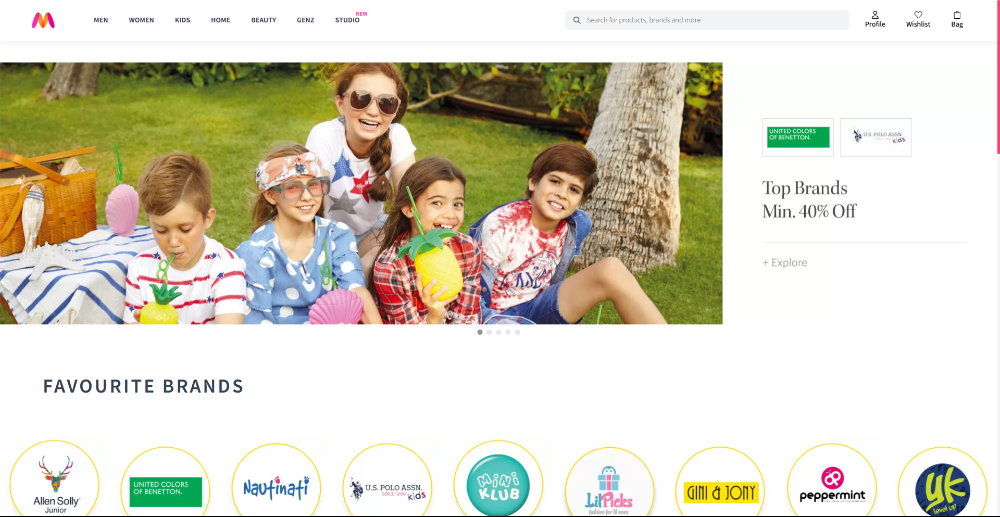

# Myntra Clone

Myntra Clone is an e-commerce web application built using **React.js** and **Tailwind CSS**. It replicates the core functionalities of the Myntra website, allowing users to browse products, filter them, add items to their wishlist or cart, and place orders.



---

## Table of Contents
1. [Introduction](#introduction)
2. [Features](#features)
3. [Pages](#pages)
4. [Tech Stack](#tech-stack)
5. [Build Process](#build-process)
6. [License](#license)
7. [Acknowledgements](#acknowledgements)
8. [Contact](#contact)

---

## Introduction
This project aims to provide an interactive and seamless shopping experience, similar to Myntra. Users can sign up, log in with JWT-based authentication, browse products, filter them, add products to their cart or wishlist, and finally, place an order.
---

## Features
- **User Authentication**: Secure login/signup with token-based authentication.
- **Product Search & Filters**: Search products using the search bar and filter them by price (low to high, high to low).
- **Wishlist**: Users can add products to their wishlist and view them on a dedicated page.
- **Cart System**: Add products to the cart and view them before proceeding to checkout.
- **Order Management**: Users can see a confirmation page after placing an order.
- **Responsive UI**: Optimized for both desktop and mobile devices.

---

## Pages
- **Home**:Showcasing all products.
- **Login**: User authentication pages.
- **Signup**: Enables new users to register.
- **Products**: Displays all products with filtering and search functionality.
- **Bag**: Shows products added to the cart.
- **Wishlist**: Displays products marked as favorites by the user.
- **Orders**: Displays the order confirmation page.

---

## Tech Stack
- **Frontend**:
- **React.js**: Frontend framework for building UI components.
- **Tailwind CSS**: Utility-first CSS framework for styling.
- **React Router**: For navigation and route management.
- **Local Storage**: Used for storing user data and authentication.

- **Backend**:
- **Node.js**:
- **Express.js**:
- **MongoDB**:
- **JWT**:
- **:

---

## Build Process
To run this project locally (MERN stack with JWT), follow the steps:

```bash
# Clone this repository
git clone https://github.com/5138prash/Myntra-Clone.git

# Navigate into the project directory
cd myntra-clone

# Install dependencies
npm install

cd Myntra-Clone

# Install dependencies in backend
cd backend
npm install

# Install dependencies in frontend
cd ../frontend
npm install

# Go to the root of the project
cd ..
npm install concurrently


# Start the development server
npm run dev


```

---

## License
This project is licensed under the [MIT License](LICENSE).

---

## Acknowledgements
Special thanks to the open-source community for providing useful libraries and frameworks.

---

## Contact
If you have any questions or suggestions, feel free to reach out:

✉️ [Email](prashanttripathi1310@gmail.com)  🌐 [GitHub](https://github.com/5138prash)  

